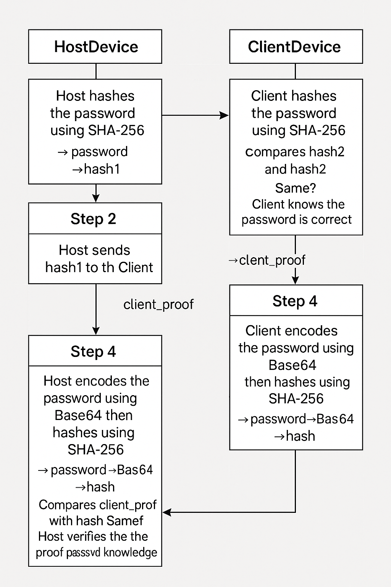

# Password-Based Mutual Authentication Protocol (AWRETY)

## 🔐 Overview

**AWRETY** (Authentication With Re-Encoded Token Yield) is a lightweight, password-based mutual authentication protocol designed for secure communication between two devices (e.g., Host and Client) on the same network.

It ensures both devices possess the correct password without ever transmitting the raw password over the network. The protocol uses **SHA-256** and **Base64 encoding** to achieve trust and identity validation between devices.

---

## 📘 How It Works

### 👣 Step-by-Step Breakdown

1. **Host Hashes the Password**
   - HostDevice computes `SHA256(password)` → `hash1`.

2. **Host Sends Hash to Client**
   - HostDevice sends `hash1` to ClientDevice.

3. **Client Validates Hash**
   - ClientDevice computes `SHA256(password)` → `hash2`.
   - Compares `hash1` and `hash2`.
     - ✅ If they match → Password is correct.
     - ❌ If not → Abort authentication.

4. **Client Sends Proof of Valid Password**
   - Client encodes its password with Base64.
   - Then computes `SHA256(Base64(password))` → `client_proof`.
   - Sends `client_proof` to Host.

5. **Host Verifies Proof**
   - Host encodes its password with Base64.
   - Computes `SHA256(Base64(password))` → `host_proof`.
   - Compares `host_proof` with `client_proof`.
     - ✅ If they match → Authentication successful.
     - ❌ If not → Reject the client.

---

## 📊 Protocol Diagram

> This diagram outlines the secure two-way verification mechanism using dual hashing.

---

## ✅ Features

- ❌ **No plaintext password transmission**
- 🔁 **Mutual validation**
- ⚡ **Lightweight for embedded/local systems**
- 🧠 **Simple to implement**

---

## 🛡️ Security Considerations

While the current protocol ensures basic mutual authentication:
- Consider adding **nonces** or **timestamps** to prevent replay attacks.
- For enhanced protection, integrate with **TLS** or use **HMAC**.
- This protocol is best suited for **closed or semi-trusted environments**.

---

## 💻 Requirements

- SHA-256 hashing function
- Base64 encoder/decoder
- TCP or UDP communication interface (e.g., sockets)

---

## 🚀 Use Cases

- IoT device pairing
- Peer-to-peer local authentication
- Embedded system verification

---

## 📂 Repository Info

**Repo Name:** `Password_Based_Mutual_Authentication_Protocol`  
**Visibility:** Public  
**Protocol Name:** AWRETY

---

## 🤝 Contributing

Pull requests are welcome. For major changes, please open an issue first to discuss what you would like to change or improve.